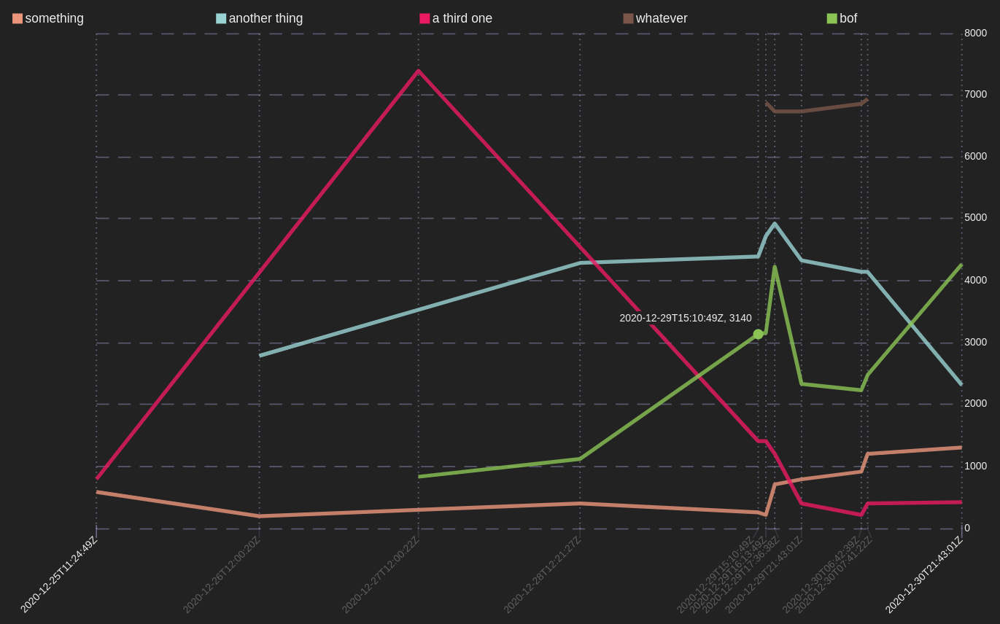

[![MIT][s2]][l2] [![Latest Version][s1]][l1] [![docs][s3]][l3] [![Chat on Miaou][s4]][l4]

[s1]: https://img.shields.io/crates/v/csv2svg.svg
[l1]: https://crates.io/crates/csv2svg

[s2]: https://img.shields.io/badge/license-MIT-blue.svg
[l2]: LICENSE

[s3]: https://docs.rs/csv2svg/badge.svg
[l3]: https://docs.rs/csv2svg/

[s4]: https://miaou.dystroy.org/static/shields/room.svg
[l4]: https://miaou.dystroy.org/3


# csv2svg

Build a SVG graph from a csv document.

## Installation

You must have [Rust installed](https://rustup.rs). Do

```cli
cargo install csv2svg
```

## Usage

### Viewing the SVG graph in a browser

If you don't pipe the output of csv2svg, the graph is automatically displayed in your browser.
For increasing readability the graph reacts to mouse hovering.

```cli
app_whose_output_is_csv | csv2svg
```

```cli
csv2svg < some/file.csv
```
### Making a file from the SVG graph

```cli
app_whose_output_is_csv | csv2svg > some/file.svg
```

```cli
csv2svg < some/file.csv > some/file.svg
```

## Example

The `examples/irregular-times.csv` files contains this:

```csv
time,something,another thing,a third one,whatever,bof
2020-12-25T11:24:49Z,580,,798,,
2020-12-26T12:00:20Z,200,2784,,,
2020-12-27T12:00:22Z,300,,7398,,826
2020-12-28T12:21:27Z,400,4282,,,1125
2020-12-29T16:13:49Z,220,4720,1409,6885,3162
2020-12-29T17:36:38Z,700,4920,1209,6730,4228
2020-12-29T21:43:01Z,800,4320,401,6737,2328
2020-12-30T06:42:39Z,920,4134,209,6856,2222
2020-12-30T07:41:22Z,1200,4136,410,6937,2481
2020-12-30T21:43:01Z,1300,2322,414,,4272
```

It may be used with no configuration:

```cli
csv2svg < examples/irregular-times.csv
```

which produces this:



## Progress

**Warning: still a work in project, expect disappointment**

* [x] most basic features
* [x] time abscissa
* [x] integer abscissa
* [ ] time stripes
* [ ] bar graph on discrete non-time x
* [ ] float abscissa
* [ ] float y values
* [ ] disjoint scales
* [ ] Windows compatibility (if somebody really wants it)


